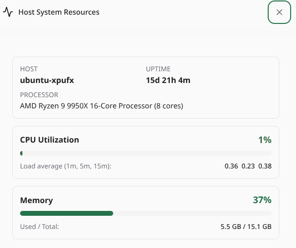

# paseo-top

<p align="center">
  
  <br /><br />
  
</p>

Live host system resource monitor for [Paseo](https://github.com/getpaseo/paseo).

Displays real-time CPU and memory metrics right in the composer track bar without cluttering the screen, with a full-detail native modal available on click.

## Features

- **Composer Pill**: Unobtrusive widget in the track bar directly above the agent prompt input.
- **Three-Tier Status Colors**:
  - 🟢 **Green** (`statusSuccess`): Normal load (< 60% CPU, < 70% RAM).
  - 🟠 **Orange** (`statusWarning`): Elevated usage (60%–84% CPU, 70%–84% RAM).
  - 🔴 **Red** (`statusDanger`): Critical usage (≥ 85% CPU or RAM).
- **Ghost Fallback**: Displays a `Ghost` icon if metrics fail or the daemon host is unreachable.
- **Native Modal Dialog**: Click the pill to pop open a detailed breakdown with visual meters:
  - CPU utilization with load averages (1m, 5m, 15m).
  - Memory usage (used vs total, percentage, Linux `/proc/meminfo` available-RAM accuracy).
  - Host info (hostname, platform, CPU model & cores, uptime).
  - Continuous live polling while open.

## Installation

Install directly with the Paseo CLI:

```bash
paseo plugin add https://github.com/xpufx/paseo-top
```

Or for local development:

```bash
git clone git@github.com:xpufx/paseo-top.git
paseo plugin add ./paseo-top
```

Once installed, it is listed as `top` in `paseo plugin ls`.

## Development

```bash
npm run typecheck
paseo plugin reload top
paseo plugin logs top
```

## License

MIT
