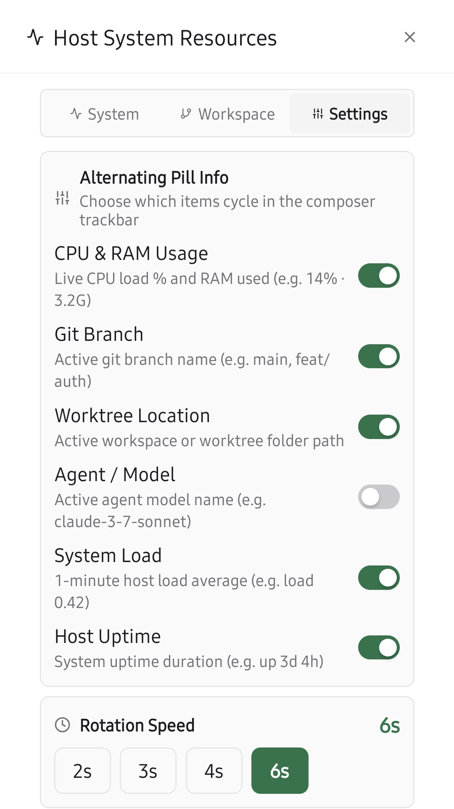

# paseo-top

<p align="center">
  
</p>

<p align="center">
  
  
  
</p>

Live host system and workspace monitor for [Paseo](https://github.com/getpaseo/paseo).

Displays real-time system performance alongside your active Git branch and worktree context directly in the composer trackbar. A tap opens a comprehensive multi-tab modal for in-depth system vitals, workspace details, and display preferences.

## Features

- **Three Pill Display Modes**:
  - **Cycle**: Smoothly rotates through enabled system metrics and workspace info one at a time right above the prompt input.
  - **All in One**: Combines all enabled metrics simultaneously into a single, compact composer pill separated by subtle dividers (`0.5% · 5.0G │ main │ paseo-top`).
  - **Multiple Pills**: Spawns a dedicated native composer pill for every single enabled switch (`[ 0.5% · 5.0G ] [ main ] [ paseo-top ]`). Tapping any dedicated pill opens the modal focused directly on its corresponding tab (`System` or `Workspace Context`).
- **Git Branch & Worktree Awareness**: Displays the active Git branch and worktree directory so you always know where your agent is operating.
- **Real-Time System Metrics**: Live CPU usage, RAM utilization, 1/5/15-minute load averages, and host uptime.
- **Color-Coded Status Thresholds**: Clear visual indicators for normal, elevated, and critical system load.
- **Full Workspace & Agent Context**: Inspect active branch, worktree filesystem path (with 1-tap copy), workspace title, project name, uncommitted git changes (`+diff / -diff`), and current agent model, provider, and idle duration.
- **Multi-Tab Modal**:
  - **System**: Circular arc gauges, CPU meters, memory breakdown, load averages, and host specs.
  - **Workspace**: Branch, worktree path, diff statistics, and agent session status.
  - **Settings**: Pill display mode selector, active item toggles, rotation speed, and default tab selection.
  - **About**: Plugin branding, author info, repository & issue links, runtime environment details, and one-click diagnostics copy.
- **Customizable Pill Info**: Choose exactly which items appear across 9 distinct metrics (CPU & RAM, Git Branch, Worktree Location, Agent Tab Title, Model, Provider, Inactivity / Idle Time, System Load, Host Uptime).
- **Fail-Safe Fallback**: If all pill switches are turned off, the pill automatically falls back to displaying CPU & RAM in-memory so the modal can always be launched.
- **Zero-Poll Efficiency**: Selectively queries only active metrics from the host; in Multiple Pills mode, each individual pill only polls the specific fields it requires.
- **Configurable Rotation Speed**: Set cycle intervals to 2s, 3s, 4s, or 6s (dynamically shown in Cycle mode).
- **Default Modal Tab Preference**: Choose which tab opens first when clicking the pill (System, Workspace, Settings, or About).
- **Automatic Cross-Device Sync**: Settings persist daemon-side and automatically synchronize across desktop, mobile, and web clients.
- **1-Tap Clipboard Copy**: Quick-copy paths, hostnames, and metadata with instant confirmation toasts.

## Installation

Install directly with the Paseo CLI:

```bash
paseo plugin add https://github.com/xpufx/paseo-top
```

Or for local development:

```bash
git clone git@github.com:xpufx/paseo-top.git
paseo plugin add ./paseo-top
```

Once installed, it is listed as `top` in `paseo plugin ls`.

## Development

```bash
npm run typecheck
paseo plugin reload top
paseo plugin logs top
```

## License

MIT
