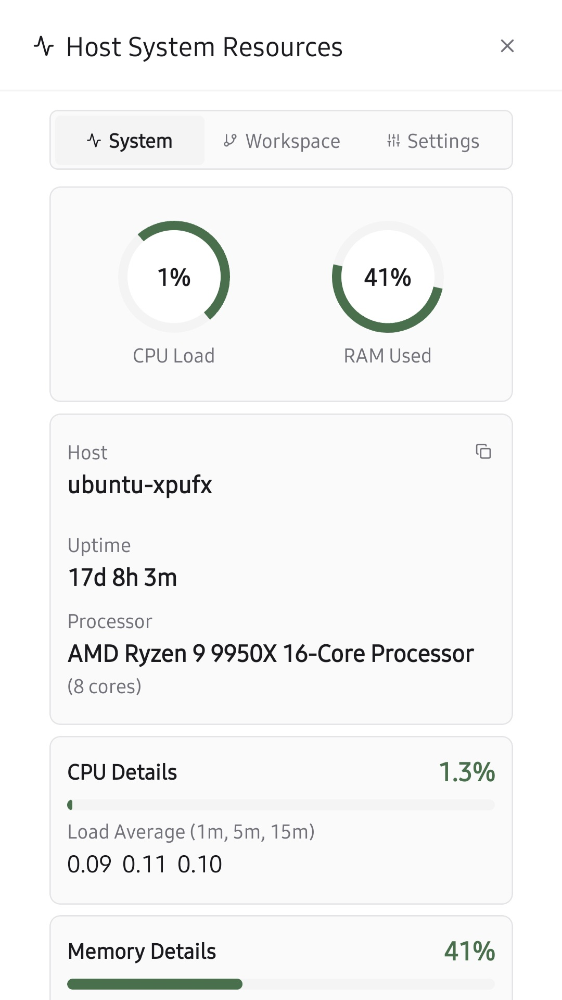
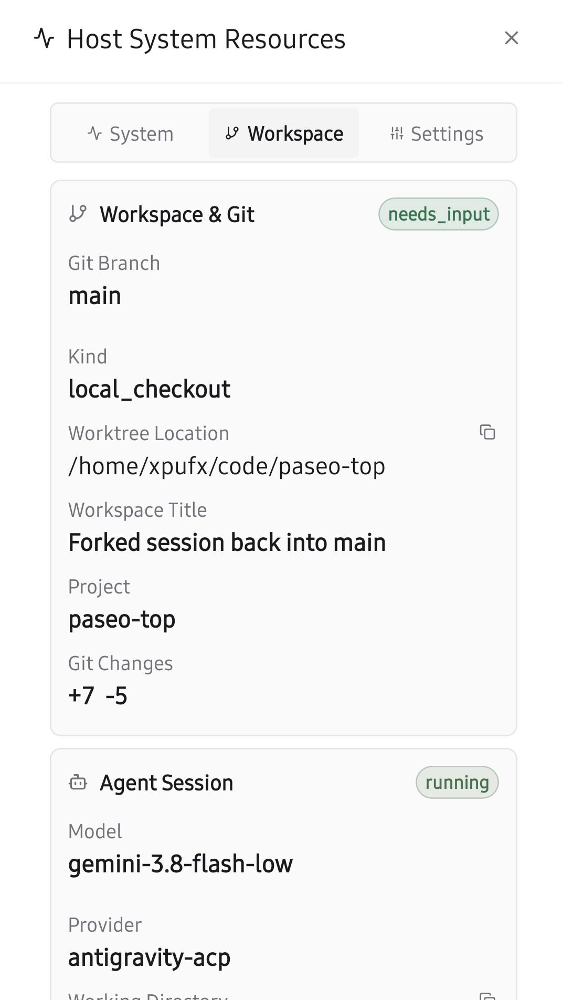

# paseo-top

<p align="center">
  
  
  <br /><br />
  
</p>

<p align="center">
  
  
  
</p>

Live host system and workspace monitor for [Paseo](https://github.com/getpaseo/paseo).

Displays real-time system performance alongside your active Git branch and worktree context directly in the composer trackbar. A tap opens a comprehensive multi-tab modal for in-depth system vitals, workspace details, and display preferences.

## Features

- **Three Pill Display Modes**:
  - **Cycle**: Smoothly rotates through enabled system metrics and workspace info one at a time right above the prompt input.
  - **All in One**: Combines all enabled metrics simultaneously into a single, compact composer pill separated by subtle dividers (`0.5% · 5.0G │ main │ paseo-top`).
  - **Multiple Pills**: Spawns a dedicated native composer pill for every single enabled switch (`[ 0.5% · 5.0G ] [ main ] [ paseo-top ]`). Tapping any dedicated pill opens the modal focused directly on its corresponding tab (`System` or `Workspace Context`).
- **Git Branch & Worktree Awareness**: Displays the active Git branch and worktree directory so you always know where your agent is operating.
- **Agent ID Pill**: Shows the 7-char agent session short ID right in the composer pill; tapping it opens the Workspace tab with the full copyable agent ID (1-tap copy, no more hunting through menus).
- **Real-Time System Metrics**: Live CPU usage, RAM utilization, 1/5/15-minute load averages, and host uptime.
- **MCP Server Health Monitoring**:
  - Displays live count of healthy vs total MCP servers in the composer pill (`● 4/4 MCP`).
  - Zero-probe efficiency: reads snapshots persisted by `paseo-mcp-tools` via `PluginStorage` without spawning child processes.
  - Full server-by-server status and latency breakdown in the System modal tab.
  - Automatically detects if `mcp-tools` plugin is running/enabled or uninstalled via `paseo-plugin-helper/server`.
- **Declarative Custom Metric Pills**:
  - Define custom shell command pills with zero TypeScript or React code by dropping `.json` or `.jsonc` files into `~/.paseo/top/pills/`.
  - Automatic poller with timeout protection, threshold evaluation (`warning`, `danger`, `invert`), and live badge color states.
  - Dedicated drilldown modal views with built-in monospace `<CodeBlock>`, copy button, and on-demand refresh command execution.
  - Live discovery: newly created or updated pill files are detected automatically without restarting Paseo.
- **Color-Coded Status Thresholds**: Clear visual indicators for normal, elevated, and critical system load.
- **Full Workspace & Agent Context**: Inspect active branch, worktree filesystem path (with 1-tap copy), workspace title, project name, uncommitted git changes (`+diff / -diff`), and current agent ID, model, provider, and idle duration.
- **Multi-Tab Modal**:
  - **System**: Circular arc gauges, CPU meters, memory breakdown, load averages, host specs, and MCP server health card.
  - **Workspace**: Branch, worktree path, diff statistics, and agent session status.
  - **Settings**: Pill display mode selector, active item toggles, rotation speed, and default tab selection.
  - **About**: Plugin branding, author info, repository & issue links, runtime environment details, and one-click diagnostics copy.
- **Customizable Pill Info**: Choose exactly which items appear across 11 distinct metrics (CPU & RAM, Git Branch, Worktree Location, Agent Tab Title, Model, Provider, Inactivity / Idle Time, Agent ID, System Load, Host Uptime, MCP Server Health).
- **Fail-Safe Fallback**: If all pill switches are turned off, the pill automatically falls back to displaying CPU & RAM in-memory so the modal can always be launched.
- **Zero-Poll Efficiency**: Selectively queries only active metrics from the host; in Multiple Pills mode, each individual pill only polls the specific fields it requires.
- **Configurable Rotation Speed**: Set cycle intervals to 2s, 3s, 4s, or 6s (dynamically shown in Cycle mode).
- **Default Modal Tab Preference**: Choose which tab opens first when clicking the pill (System, Workspace, Settings, or About).
- **Automatic Cross-Device Sync**: Settings persist daemon-side and automatically synchronize across desktop, mobile, and web clients.
- **1-Tap Clipboard Copy**: Quick-copy paths, hostnames, and metadata with instant confirmation toasts.

## Custom Metric Pills

Extend `paseo-top` with user-defined metric pills by creating declarative JSON or JSONC configuration files in `~/.paseo/top/pills/`.

Ready-to-use drop-in examples are included in the [`examples/pills/`](examples/pills/) directory:
- [`examples/pills/disk-usage.jsonc`](examples/pills/disk-usage.jsonc): Root filesystem free space via `df -h`.
- [`examples/pills/docker-containers.jsonc`](examples/pills/docker-containers.jsonc): Running Docker container count.
- [`examples/pills/gpu-nvidia.jsonc`](examples/pills/gpu-nvidia.jsonc): NVIDIA GPU utilization via `nvidia-smi`.
- [`examples/pills/battery.jsonc`](examples/pills/battery.jsonc): Laptop battery capacity with inverted thresholds.
- [`examples/pills/git-dirty.jsonc`](examples/pills/git-dirty.jsonc): Active uncommitted git modifications.

To activate any example instantly, copy it into your local pills directory:

```bash
cp examples/pills/disk-usage.jsonc ~/.paseo/top/pills/
```

Every configuration file in `~/.paseo/top/pills/` generates an active pill in Paseo's composer trackbar, backed by background polling and an on-demand drilldown modal.

### Example 1: GPU Utilization (NVIDIA)

Create `~/.paseo/top/pills/gpu.jsonc`:

```jsonc
{
  "id": "gpu-util",
  "title": "GPU",
  "compactTitle": "GPU",
  "icon": "Cpu",
  "command": "nvidia-smi --query-gpu=utilization.gpu --format=csv,noheader,nounits",
  "suffix": "%",
  "intervalMs": 3000,
  "timeoutMs": 2000,
  "thresholds": {
    "warning": 70,
    "danger": 90
  },
  "modal": {
    "title": "GPU Vitals & Memory",
    "description": "Live status from nvidia-smi",
    "command": "nvidia-smi",
    "preformatted": true
  }
}
```

### Example 2: Active Docker Containers

Create `~/.paseo/top/pills/docker.jsonc`:

```jsonc
{
  "id": "docker-containers",
  "title": "Docker",
  "icon": "Box",
  "command": "docker ps -q 2>/dev/null | wc -l",
  "suffix": " running",
  "intervalMs": 5000,
  "modal": {
    "title": "Running Docker Containers",
    "command": "docker ps --format 'table {{.Names}}\t{{.Status}}\t{{.Ports}}'"
  }
}
```

### Configuration Options

| Field | Type | Description |
| :--- | :--- | :--- |
| `id` | `string` | Unique identifier for the pill (e.g. `gpu-util`). |
| `title` | `string` | Label displayed in standard composer trackbar. |
| `compactTitle` | `string?` | Optional shorter title shown when screen is narrow or on mobile. |
| `icon` | `string?` | Lucide icon name (e.g. `Cpu`, `Box`, `Activity`, `HardDrive`). |
| `command` | `string` | Shell command executed periodically to get the metric value. |
| `prefix` / `suffix` | `string?` | Optional strings prepended or appended to the formatted output (e.g. `%`, ` running`). |
| `intervalMs` | `number?` | Polling interval in milliseconds (default: `5000`). |
| `timeoutMs` | `number?` | Execution timeout in milliseconds (default: `5000`). |
| `thresholds` | `object?` | Numeric thresholds for color styling: `warning`, `danger`, and `invert` (for metrics like battery where lower is worse). |
| `modal` | `object?` | Detailed drilldown modal options: `title`, `description`, and `command` (run on demand when opened or refreshed). |
| `enabled` | `boolean?` | Enable or disable the pill without deleting the file (default: `true`). |

## Installation

Install directly with the Paseo CLI:

```bash
paseo plugin add https://github.com/xpufx/paseo-top
```

Or for local development:

```bash
git clone git@github.com:xpufx/paseo-top.git
paseo plugin add ./paseo-top
```

Once installed, it is listed as `top` in `paseo plugin ls`.

## Development

```bash
npm run typecheck
paseo plugin reload top
paseo plugin logs top
```

## License

MIT
